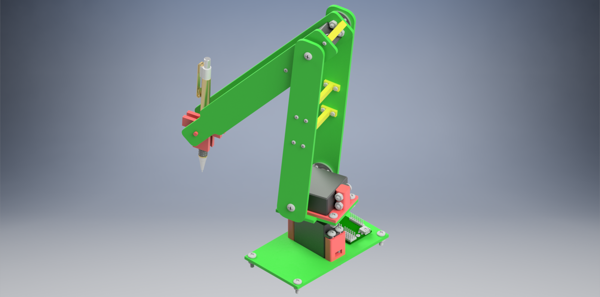

# 6.A01
This is my project for MIT's 6.A01 Fall 2016. 

Dexter is a 4-DOF robotic arm capable of performing a variety of drawing-related tasks. At the time of writing, Dexter can fetch the weather, draw images from the Internet, and chat with you! The entire system can be operated using voice control using any modern browser supporting the Web Speech API. 

The back end is written in Python 3 and uses asyncio along with the WAMP protocol to communicate with the front end. Notable features include real-time inverse kinematics, asynchronous communcation, automated path optimization, and accurate servo synchronization. 

### Dexter
This is Dexter. All parts can be made using laser-cut acrylic or a 3D printer. The CAD package is located in [docs/cad.7z](docs/cad.7z). It must be opened using Autodesk Inventor 2017 or higher. 

### Running

It's relatively easy to begin using Dexter. Follow the steps below to get started.

1. (optional) Generate new server certificates and change passwords for all devices.
2. Start Crossbar from inside of `src/crossbar`. This can be on any device that allows incoming SSL connection on port 443.
3. Navigate to the the IP of the device running Crossbar. Use HTTPS and skip any security notifications you may receive.
4. Edit the IP in `src/config/main.py` to match that of the machine running Crossbar.
5. Run `automaton.py` ensuring that `src` is in `PYTHONPATH`.

### Commands
The robot responds to the following voice commands. Commands are listed in order of priority.

Command | Function
--- | ---
dexter | Wake up the robot. No other commands will work until the robot is woken.
(dexter) calibrate | Set the current z position as the z-depth parameter.
(dexter) get position | Get the current (x, y, z) position.
(dexter) home | Go to the home position.
(dexter) info | Provide info on configuration parameters.
(dexter) ready | Asks the robot if all modules have initialized.
(dexter) sleep | Put the robot to sleep. No commands will work until the robot is woken again.
(dexter) stop | Stop the current drawing.
(dexter) draw the weather | Draw today's weather using data from Open Weather Map.
(dexter) draw the weather in `:value` `:units` | Draw the forecast using data from Open Weather Map. `:value` can be any float. `:units` can be one of minute(s), hour(s), day(s), or week(s).
(dexter) draw index `:i` query `*q` | Similar to draw, but allows an offset index. `:i` can be any integer. `*q` can be any text.
(dexter) draw `*q` | Queries Pixabay for a desired SVG. `*q` can be any text.
(dexter) trace index `:i` query `*q` | Similar to trace, but allows an offset index. `:i` can be any integer. `*q` can be any text.
(dexter) trace `*q` | Queries Pixabay for a desired image. Use Potrace to convert to SVG. `*q` can be any text.
(dexter) move `:direction` `:float` | Move the arm a certain amount in a particular direction. `:direction` can be one of up, down, left, right, forward, or backward. `:float` can be any float.
(dexter) move (to) `:x`, `:y`, `:z`, `:phi` | Move to a constraint in space. `:x`, `:y`, `:z`, `:phi` can be any float.
(dexter) move (to) `:x`, `:y`, `:z` | Move to a coordinate in space. `:x`, `:y`, `:z` can be any float.
(dexter) load point `:name` | Load a previously saved position. `:name` can be any text.
(dexter) save point as `:name` | Save the arm's current position under an alias. `:name` can be any text.
(dexter) set `:parameter` `:float` | Set a configuration parameter. `:parameter` can be one of lift, speed, offset, or depth. `:float` can be any float.
(dexter) `*input` | All other inputs will query Cleverbot for a response. `:input` can be any text.

### Requirements

The following software are required to run this project.

- Python 3.5 or higher
- Python packages: numpy, scipy, matplotlib, pillow (PIL), autobahn, requests, cleverbot, pyowm, cssutils, yahoo-finance
- Crossbar.io (or equivalent router supporting WAMP 2)
- A browser that supports the Web Speech API (Chrome 33+ or Firefox 49+)

### References

This project's SVG parser uses some modified implementations from the following packages.

- [svg.path](https://github.com/regebro/svg.path)
- [svgpathtools](https://github.com/mathandy/svgpathtools)
- [svg](https://github.com/cjlano/svg)
- [Flatten.js](https://gist.github.com/timo22345/9413158)

